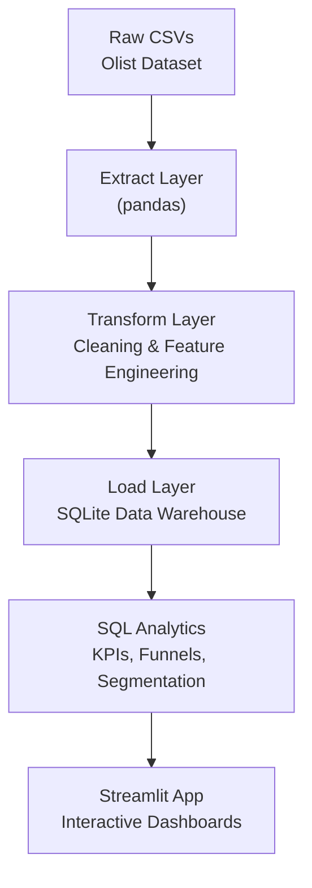

# 📊 E-Commerce Analytics — End-to-End Data Pipeline + SQL Warehouse + Streamlit Dashboard  

This repository demonstrates a **production-style analytics workflow** for an e-commerce business — including ETL pipelines, SQL-based analytics warehouse, KPI computation, and a fully interactive Streamlit dashboard.

It is designed to mirror :
- Data cleaning & preprocessing  
- KPI design & business analytics  
- Customer segmentation & product insights  
- Relational data modeling (fact/dim tables)  
- SQL analytics + interactive dashboards  

---

## 🚀 **Live Demo (Streamlit App)**
👉 **https://your-streamlit-cloud-url-here**  

The dashboard includes:
- KPI overview  
- Order funnel  
- Customer 360 insights  
- Product intelligence  
- Segmentation visualizations  

---

## 🧠 **Project Motivation**

E-commerce companies generate rich datasets across orders, customers, products, payments, and delivery operations.  
This project showcases how to transform those raw logs into actionable insights using:

- A clean **ETL pipeline**  
- A simplified **analytics warehouse**  
- **SQL-first** KPI calculations  
- A lightweight, client-friendly **Streamlit dashboard**  


---

# 🧱 **Architecture Overview**



---

# 🏗️ **Data Warehouse Schema (SQLite)**

The project uses a simple but powerful **star schema**:

```
ecommerce.db
│
├── fact_orders
│     order_id
│     customer_id
│     product_id
│     order_status
│     order_purchase_timestamp
│     revenue
│     delivery_delay_days
│     review_score
│     purchase_month
│
├── dim_customers
│     customer_id
│     customer_unique_id
│     city
│     state
│
├── dim_products
│     product_id
│     product_category_name
│
└── dim_time
      date
      date_key
      year
      month
      weekday
```

This structure enables fast SQL analytics across revenue, customers, and product behavior.

---

# ⚙️ **Tech Stack**

| Layer | Tools |
|-------|-------|
| Extract / Transform | Python, Pandas |
| Load | SQLite (via pandas.to_sql) |
| Data Modeling | Star Schema (Fact + Dim Tables) |
| Analytics | SQL (KPI queries, segmentation, funnel analysis) |
| Visualization | Plotly, Streamlit |
| Deployment | Streamlit Cloud |

---

# 🔄 **ETL Pipeline**

### Extract
Loads raw CSVs from:

```
data/raw/
```

### Transform
- Parsing timestamps  
- Merging multiple tables  
- Feature engineering:  
  - revenue  
  - delivery delay  
  - order-to-delivery time  
  - purchase month  
- RFM-like customer metrics  

### Load
Stores analytics-ready tables into SQLite:

```
data/ecommerce.db
```

Run:

```bash
python etl/run_etl.py
```

---

# 📈 **Dashboard Features**

### ✔ KPI Overview  
Orders, revenue, AOV, reviews, on-time delivery rate

### ✔ Order Funnel  
Status distribution across the purchase lifecycle

### ✔ Customer 360  
- Customer distribution by geography  
- Revenue contribution by location  
- Customer segmentation (frequency vs revenue)

### ✔ Product Intelligence  
- Top categories by revenue  
- Top products  
- Delivery delay analysis by category  
- Performance summary table  

---

# ▶️ **Run Locally**

1. Clone the repository:

```bash
git clone https://github.com/ranjita-naik/ecommerce-analytics-end-to-end.git
cd ecommerce-analytics-end-to-end
```

2. Install dependencies:

```bash
pip install -r requirements.txt
```

3. Run ETL:

```bash
python etl/run_etl.py
```

4. Launch dashboard:

```bash
streamlit run app/app.py
```

---

# 📂 **Repository Structure**

```
ecommerce-analytics-end-to-end/
│
├── app/                       # Streamlit app
│   ├── app.py
│   ├── pages/
│   │   ├── 1_Overview.py
│   │   ├── 2_Funnel.py
│   │   ├── 3_Customer_Insights.py
│   │   └── 4_Product_Insights.py
│   └── utils/
│       └── sql_reader.py
│
├── etl/
│   ├── extract.py
│   ├── transform.py
│   ├── load_sqlite.py
│   └── run_etl.py
│
├── sql/                       # Analytics queries
│   ├── kpis.sql
│   ├── funnel.sql
│   ├── customers_segmentation.sql
│   ├── products_top_categories.sql
│   └── ...
│
├── data/
│   ├── raw/                   # (ignored)
│   ├── processed/
│   └── ecommerce.db           # SQLite warehouse
│
├── notebooks/
│   └── exploration.ipynb
│
├── requirements.txt
└── README.md
```

---


